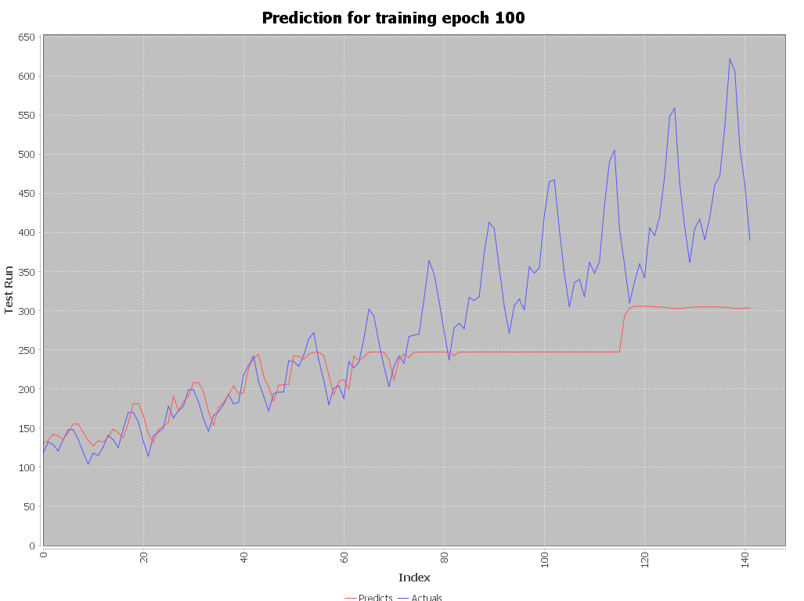

# LSTM with DL4J in Scala

This projects aim is to evaluate the DL4J Platform with Scala.

**Data**

The data is available [here](https://datamarket.com/data/set/22u3/international-airline-passengers-monthly-totals-in-thousands-jan-49-dec-60#!ds=22u3&display=line).
It shows some intersting periodic characteristics over time, while a clear trend is visible:

**Demo Result**

My LSTM Model seems to be to simple and only predicts a (more or less) constant, even though there's a positive trend!

While the predictions absolute error gets smaller and smaller, its still far away from good. Help!